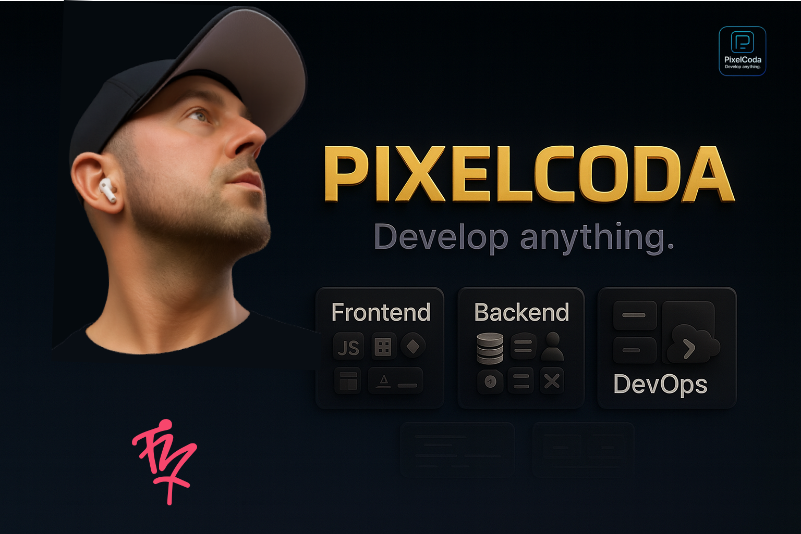

<!-- ====================
     GitHub Profile Banner
==================== -->

  

xxxxx
<!-- ====================
     Tech Stack & Toolsxx
==================== -->
<h3 align="center">My Tech Stack 🛠️</h3>
<table align="center">
  <tr>
    <td align="center">1
      <strong>Frontend</strong> 
      
    </td>
    <td align="center">
      <strong>Backend</strong> 
      
    </td>
  </tr>
  <tr>
    <td align="center">
      <strong>DevOps & Deployment</strong> 
      
    </td>
    <td align="center">
      <strong>Tools & Platforms</strong> 
      
    </td>
  </tr>
</table>

<!-- ====================
     Connect With Me
==================== -->
<h3 align="center">Let's Connect 🔗</h3>

  
  

