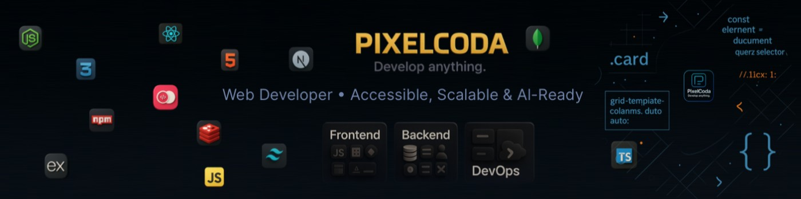
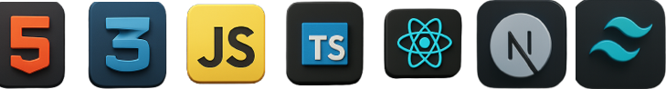
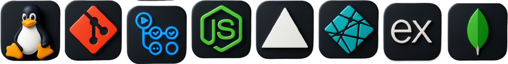

<!-- ====================
     GitHub Profile Banner
==================== -->

  

<!-- ====================
     Name & Intro
==================== -->
<h1 align="center">Casian Blanaru</h1>

  <strong>Web Developer for Accessible, AI-Powered & Scalable Frontends and Backends</strong> 
  <em>Vue · React · Next.js · TypeScript · Laravel · Tailwind · BITV 2.0 · AI Automation</em>

<!-- ====================
     Tech Stack & Tools
==================== -->
<h3 align="center">🛠️ My Tech Stack</h3>

<table align="center" style="width: 100%; max-width: 1200px;">
  <tr>
    <td align="center" style="width: 50%;">
      <strong>Frontend</strong>  
      
    </td>
    <td align="center" style="width: 50%;">
      <strong>Backend</strong>  
      
    </td>
  </tr>
  <tr>
    <td align="center" style="width: 50%;">
      <strong>DevOps & Deployment</strong>  
      
    </td>
    <td align="center" style="width: 50%;">
      <strong>Tools & Platforms</strong>  
      
    </td>
  </tr>
</table>

<!-- ====================
     Featured Projects
==================== -->
<h3 align="center">🚀 Featured Projects</h3>

  <a href="https://pixelcoda.de" target="_blank">💼 pixelcoda.de</a> – Mein Entwicklerportfolio

<!-- ====================
     Connect With Me
==================== -->
<h3 align="center">🔗 Let's Connect</h3>

  
  &nbsp;&nbsp;&nbsp;
  

<!-- ====================
     GitHub Stats (optional)
==================== -->
<h3 align="center">📊 GitHub Stats</h3>

  

